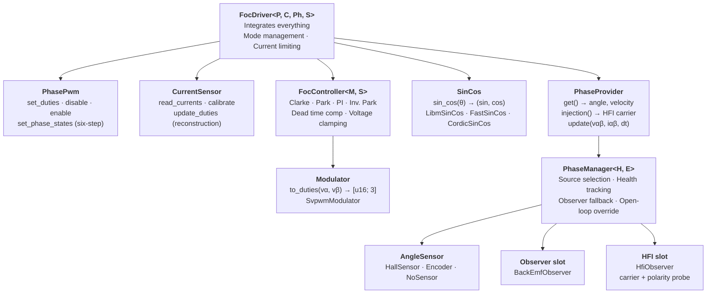
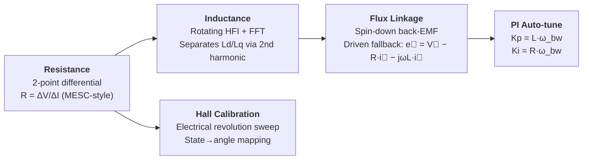

# OxiFOC

Field-Oriented Control (FOC) firmware for STM32 motor controllers, written in
Rust. This fork's active motor target is
[`oxifoc-f103`](oxifoc-f103/README.md): a core-backed, Hall-only STM32F103
application with a fixed-point 16 kHz control loop and stock-bike CAN. The
STM32G474/F405 applications remain as source references and are excluded from
the validation build.

## Core Architecture (`oxifoc-core`)

All platform-neutral FOC algorithms and phase estimation live in
`oxifoc-core`, a `no_std` library with no hardware dependencies. The compact
current loop is generic over its numeric and angle backends; Clarke/Park,
discrete PI, circular limiting, and sector SVPWM each have one implementation.

| Core feature | Purpose | Linked by F103 |
|--------------|---------|----------------|
| `fixed-point` | Builds the shared controller with Q16.16 values and Q0.32-turn integer CORDIC | Yes |
| `algorithms` | Adds the `f32` backend plus the original observer/HFI, detection, and optional async runtime | No |

The `ControlPhaseProvider` boundary and `PhaseStrategy` identities retain Hall,
encoder, back-EMF observer, HFI, hybrid, manual, and open-loop strategies. Only
`HallTracker` is currently linked into the F103 ride image; the complete
floating-point estimators remain under `foc::phase` as experiment and porting
references.

```text
oxifoc-f103 control ISR
├── config + control + safety
├── hardware + sensors + transport
└── oxifoc-core::foc
    ├── FocKernel<Fixed, CordicTurns>
    ├── shared transforms → discrete PI → SVPWM
    └── phase::ControlPhaseProvider → HallTracker today
```

The following trait graph describes the original floating-point reference
backend retained in `oxifoc-core`.

### Trait Abstraction



Platform crates implement `PhasePwm` (TIM1 complementary PWM), `CurrentSensor` (shunt ADC reading), and `SinCos` (CORDIC hardware or software libm). Everything else is shared.

### Phase Source Selection

`PhaseManager` supports multiple angle estimation strategies with runtime
switching (host command `cmd/phase_source`; the active source is reported
back via slow telemetry). Both software estimators run concurrently in
dedicated slots and are armed automatically from stored motor parameters
at boot:

| Source | Use Case |
|--------|----------|
| `Hall` | Direct Hall sensor angle |
| `Encoder` | Incremental encoder |
| `Observer` | Back-EMF sensorless (high speed) |
| `Hfi` | High-frequency injection sensorless (zero/low speed) |
| `HallToObserver` | Hall at low speed, velocity-blended crossover to observer, automatic fallback on Hall failure |
| `HfiToObserver` | HFI at standstill, velocity-blended crossover to observer |
| `Manual` / `OpenLoop` | Calibration and detection |

### Motor Detection

Automated parameter measurement, platform-agnostic via `DetectionHardware` trait:



Each step uses conservative PI gains (`DETECTION_PI_KP/KI`) delivered via `ControlMode::OpenLoop { pi_gains }`. Detection accuracy validated against 10 simulated motors (`detection_report` example).

### Virtual Motor

`VirtualMotor` simulates a PMSM electrically and mechanically (R, Ld, Lq, flux linkage, inertia, friction). Combined with `FocController`, it enables closed-loop testing of the full detection pipeline and FOC control without hardware.

```bash
cargo run -p oxifoc-core --example detection_report --features virtual-motor,std
```

### Control Modes

```rust
enum ControlMode {
    Stopped,                        // PWM disabled
    CurrentControl { iq, id },      // Torque/field control
    OpenLoop { angle, current, velocity, pi_gains },  // Detection/calibration
    DirectVoltage { vd, vq, angle },// Bypass PI (HFI measurement)
    Coast,                          // All FETs off (flux measurement)
    SixStep { duty },               // Trapezoidal (bringup)
    VelocityControl, PositionControl, // TODO
}
```

### Fast Telemetry

Lock-free ISR → host streaming via bbqueue:

```
ISR (20kHz) → decimation (atomic period) → bbqueue (2KB) → async drain → ergot topic → host
```

46 bytes/sample (ia/ib/ic/id/iq/vd/vq/angle/erpm/duty/hall/seq). Zero overhead when disabled. Overflow drops samples silently.

## Network Architecture

All devices communicate via [ergot](https://github.com/jamesmunns/ergot) — a lightweight embedded networking protocol with automatic routing and address assignment.

Every motor controller runs as a **Router** — when standalone it acts as a root, when connected to another controller it becomes a bridge. Host apps and peripherals connect as **Edge** devices. This means identical firmware regardless of network topology.

```
Motor Controller (Root Router)
├── PC ─────────────────── Edge (USB / UART / RTT)
├── Secondary Motor Ctrl ─ Bridge Router (CAN FD)
│   └── ...               (its own edge devices)
├── BMS ──────────────── Edge (CAN FD)
└── ESP32-C6 ──────────── Bridge Router (UART + BLE)
    ├── ESK8 Remote ───── Edge (BLE, ESP32-C6)
    └── Android App ───── Edge (BLE)
```

Roles are determined by topology, not firmware — disconnect two controllers and each becomes its own root. The host app discovers and addresses all devices in the network automatically through the routing tree.

## Hardware

| Board | MCU | Current Sensing | Communication | Gate Driver |
|-------|-----|-----------------|---------------|-------------|
| Recovered S73 controller | STM32F103RE-class | Two low-side phase shunts | CAN 2.0B, 250 kbit/s | Discrete power stage |
| Cheap FOCer 2 | STM32F405RG | DRV8301 (10 V/V) | USB + UART | DRV8301 SPI |
| Flipsky VESC 6 MK5 | STM32F405RG | DRV8301 (20 V/V) | USB + UART | DRV8301 SPI |
| NUCLEO-G474RE + IHM08M1 | STM32G474RE | External op-amps | USB + LPUART | L6398 |

The F103 target uses 16 kHz center-aligned TIM1 PWM, CC4-triggered injected
current samples, and TIM2 Hall capture. The reference platforms retain their
original 20 kHz/Embassy architecture.

## Host Tools

**GUI** (`oxifoc-host-slint`) — Slint desktop app with GPU-accelerated real-time charts (WGPU). Motor control, detection wizard, config read/write.

**CLI** (`oxifoc-host-cli`) — Command-line monitor, motor control, detection.

**Virtual device** (`oxifoc-virtual`) — Simulated motor controller over TCP/UDP. Host tools connect exactly as to real hardware.

Transports: Serial (UART VCP), RTT (probe-rs), TCP (virtual), UDP (virtual), USB (nusb).

## Building

```bash
just check                # fmt + clippy + tests
just build-f103           # Build STM32F103 firmware
just image-f103           # Build the 26,200-byte CAN bootloader image
just flash-f103           # Validate the image without transmitting
just flash-f103 --yes     # Flash over gs_usb CAN channel 0 at 250 kbit/s
just gui                  # Run Slint GUI
just cli -- list          # Run CLI
```

The STM32F103 firmware requires Rust nightly with the `thumbv7m-none-eabi`
target. Host crates build with stable Rust.

The CAN updater preserves the resident bootloader and replaces only its
application region. Keep the wheel stationary before requesting the reset: the
application requires disabled motor output, 500 ms of quiet motor Halls, and a
separately qualified quiet PB4 wheel input. Running `just flash-f103` without
`--yes` validates the image and transmits nothing; real updates are captured in
an ignored `scratch/can_log_bootloader_flash-*.log` file.

## Testing

```bash
cargo test --workspace                              # Host tests
cargo test -p oxifoc-core --features virtual-motor  # Virtual motor + detection
```

## Development Status

Known gaps and planned work are tracked in [docs/TODO.md](docs/TODO.md);
safety-layer roadmap in [docs/safety.md](docs/safety.md).

## License

Licensed under either of:

- Apache License, Version 2.0 ([LICENSE-APACHE](LICENSE-APACHE))
- MIT license ([LICENSE-MIT](LICENSE-MIT))

at your option.
